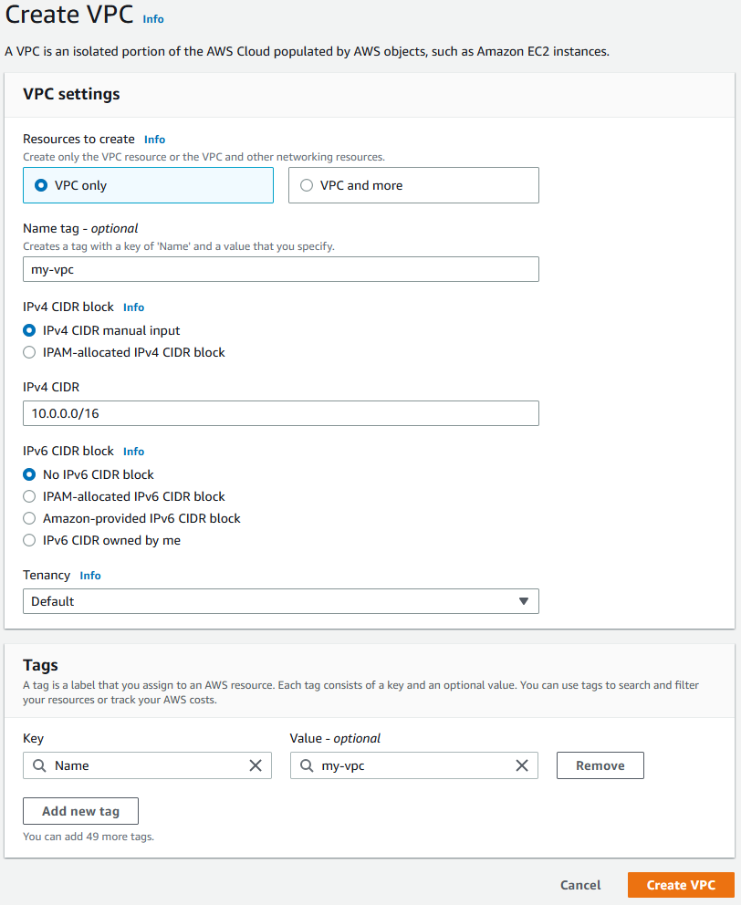
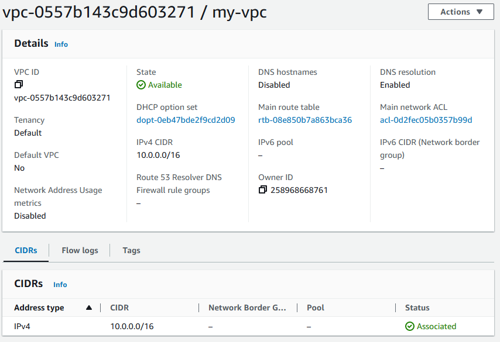
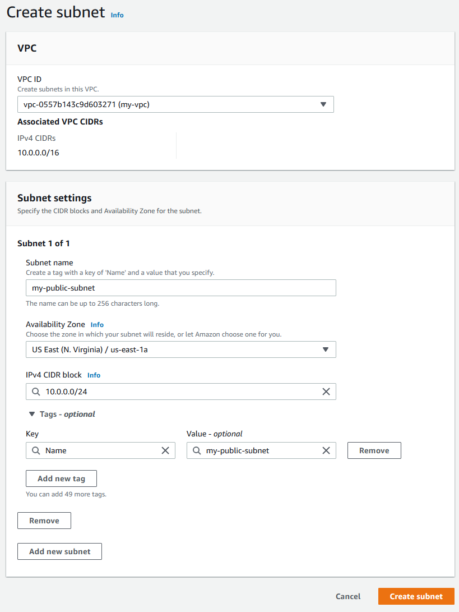
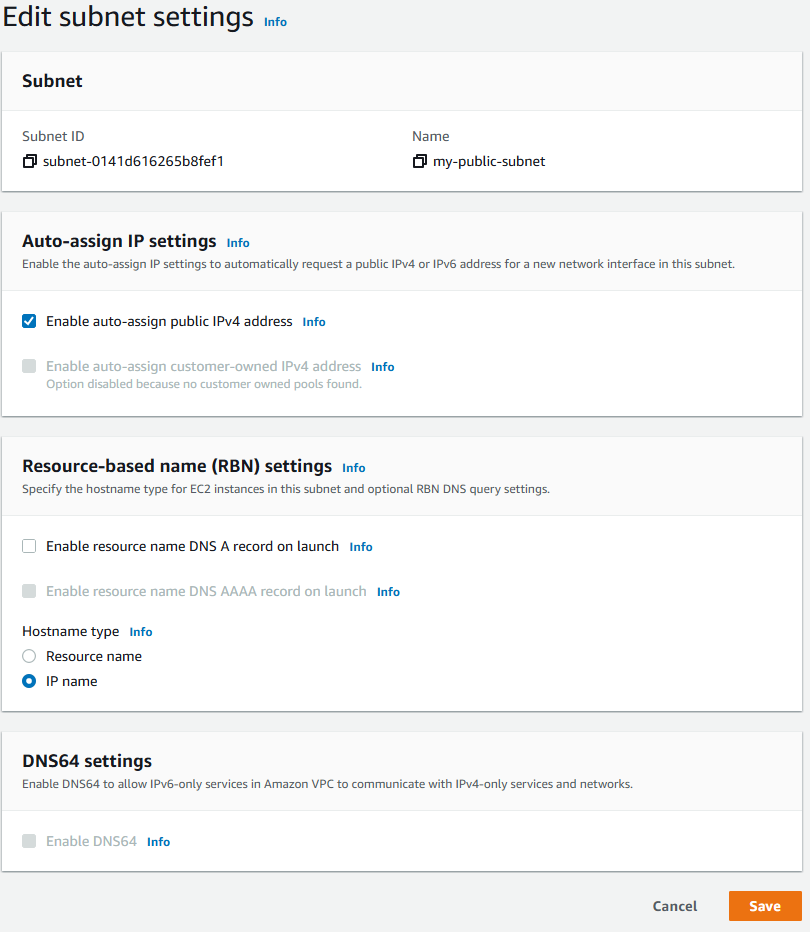
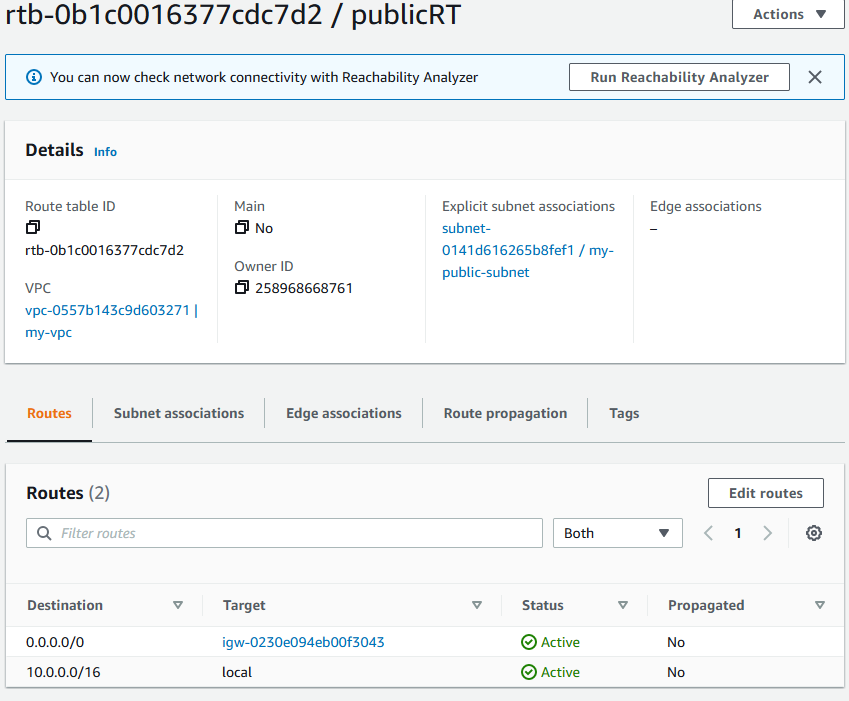

# EC2 instance in a VPC

## Ashton Uttayaya

*Key Elements:*

1. Setting up basic lamda function
2. Python script that prints message with first and last name
3. Demonstrates Lambdas built in test function
4. Displays test reults
5. Shows CloudWatch logs

#### Screenshots:

Lambda Configuration       | Python Code               |
:-------------------------:|:-------------------------:|
    |    |

Test Event                 | Test Results              |
:-------------------------:|:-------------------------:|
     |   |

CloudWatch Logs            | 
:-------------------------:|
 |

