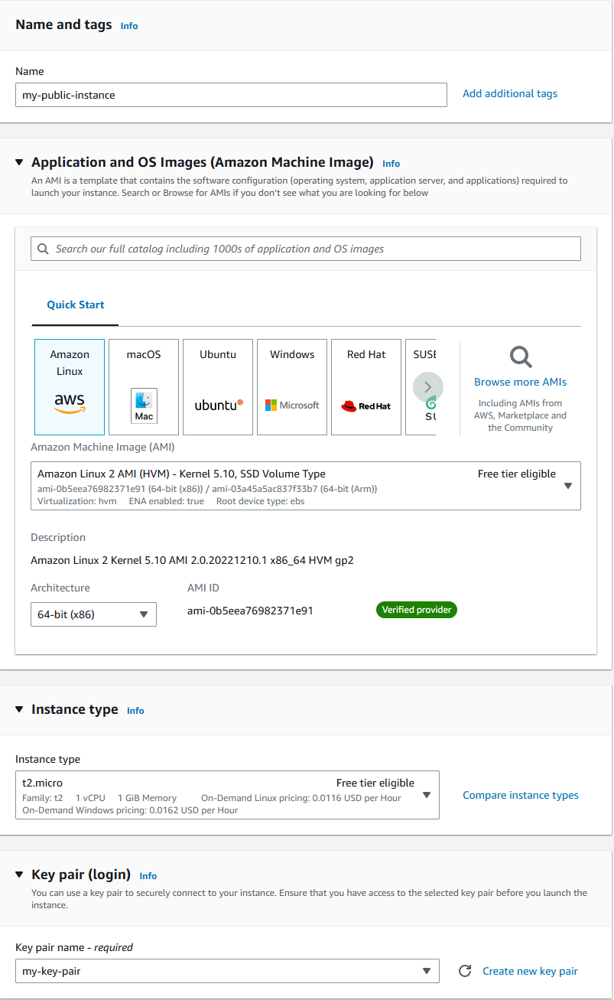

# EC2 instance in a VPC

## Ashton Uttayaya

*Key Elements:*

1. Creates VPC
2. Creates sub routes
3. Route table allows for VPC to connect to public internet
4. EC2 added to VPC
5. EC2 generates key pairs for connection via ssh

#### Screenshots:

VPC Creation               | my-vpc                    |
:-------------------------:|:-------------------------:|
       |    |

Creating Subnet            | Editing Subnet            |
:-------------------------:|:-------------------------:|
    |   |

Route Table w/ Connections | 
:-------------------------:|
 |

Creating EC2               | EC2 pt. 2                 |
:-------------------------:|:-------------------------:|
       |     |

Connection to EC2 via Console | EC2 Terminal                 |
:-------------------------:|:-------------------------:|
 |     |