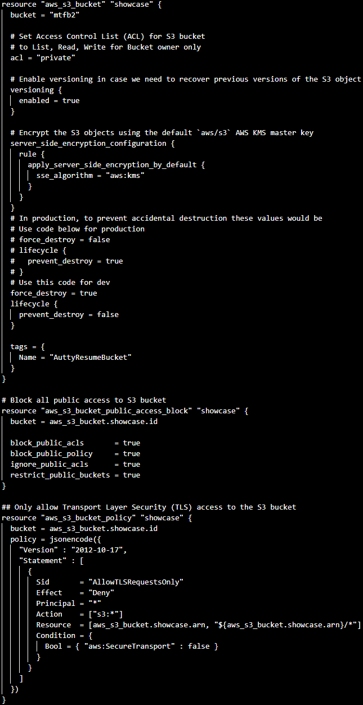
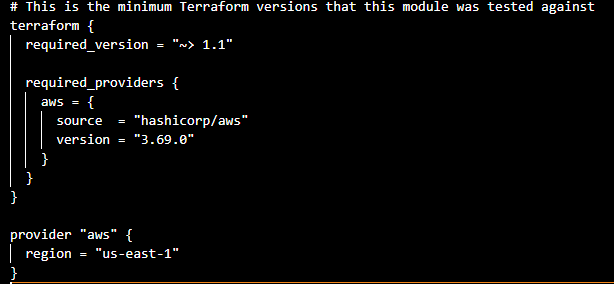

# Terraform

## Ashton Uttayaya

*Key Elements:*

1. Using terraform to create a S3 bucket
2. Sets access control list for S3 bucket
3. Enables versioning
4. Encrypts S3 elements
5. Configures security

#### Screenshots:

Main Code                  | Providers                 |
:-------------------------:|:-------------------------:|
 |  |

